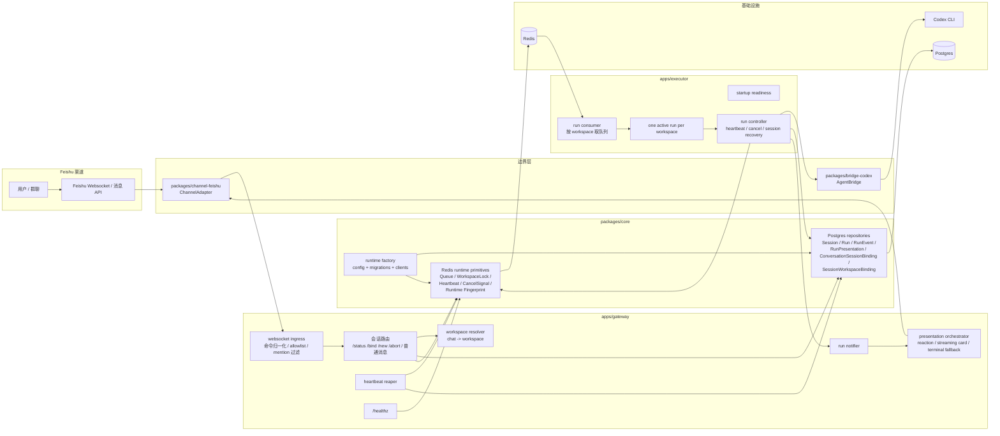
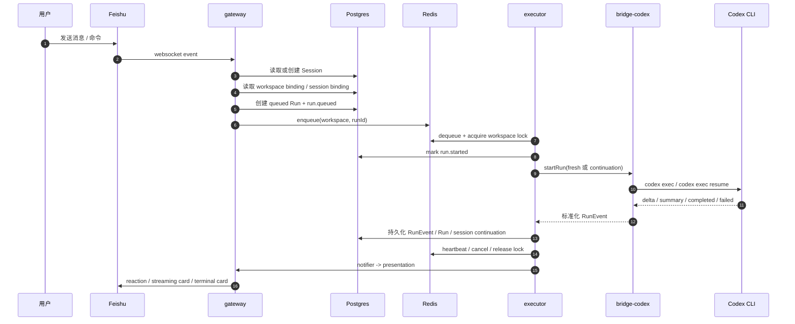

# 架构说明

本文描述当前已经落地的实现，不是远期蓝图。当前范围覆盖：

- `Feishu websocket` 入站
- `Codex CLI` 执行桥接
- 本地单机双进程 runtime：`gateway` + `executor`
- 单 workspace 串行执行
- 运行中卡片与终态结果呈现
- 同一飞书 `chat` 的 Codex 原生 session 续聊

## 1. 一张图看懂当前系统

### 读图方式

- 用户消息先进入 `packages/channel-feishu`，在这里完成 websocket 接入、过滤和归一化。
- `apps/gateway` 负责把消息变成命令或运行请求，并决定当前 `chat` 该落到哪个 workspace。
- `packages/core` 提供统一领域模型、Postgres 仓储以及 Redis 协调原语。
- `apps/executor` 只负责消费排队任务、获取 workspace 锁、驱动 Codex 执行和维护运行期状态。
- `gateway` 和 `executor` 都不会直接耦合 Feishu SDK 或 Codex CLI 细节，它们分别通过 `ChannelAdapter` 和 `AgentBridge` 边界访问外部系统。

## 2. 运行主流程

### 主流程分解

1. `gateway` 通过 `chat_id` 找到或创建 `Session`。
2. 普通消息会先经 `workspace resolver` 决定目标 workspace，再根据 `ConversationSessionBinding` 判断是 `fresh` 还是 `continuation`。
3. `Run` 先写入 Postgres，再把 `runId` 放进 Redis 队列。
4. `executor` 按 workspace 拉取队列，并通过 Redis 锁保证同一 workspace 同时只有一个活动运行。
5. `bridge-codex` 把 `Codex CLI` 输出转换成统一的 `RunEvent`，例如 `agent.output.delta`、`run.completed`、`run.failed`。
6. 终态和展示状态都持久化到 Postgres，Feishu 出站消息则由通知与呈现服务负责。

## 3. 模块职责

### `apps/gateway`

- 提供 `Hono` HTTP 服务和 `/healthz`
- 建立 Feishu websocket ingress
- 处理 `/status`、`/bind`、`/new`、`/abort`、`/help`
- 解析普通消息并创建 `queued run`
- 负责 `presentation orchestrator` 和 `heartbeat reaper`

### `apps/executor`

- 启动时检查 `Postgres`、`Redis`、`Codex CLI`
- 消费 Redis 队列
- 获取 workspace 锁并启动运行
- 维护 heartbeat、取消、续聊恢复
- 在运行事件到达时调用通知与结果呈现

### `packages/channel-feishu`

- websocket 握手和消息接入
- allowlist / mention 过滤
- 文本归一化为 `InboundEnvelope`
- 发送 reaction、运行中卡片、完成态卡片和 fallback 消息

### `packages/bridge-codex`

- 封装 `codex exec --json`
- 封装 `codex exec resume --json`
- 把 CLI JSONL 流转换成标准 `RunEvent`
- 在终态事件中回传 `bridge_session_id` 和 `session_outcome`
- 当续聊 session 无效时返回 `session_invalid`

### `packages/core`

- 领域模型定义：`Session`、`Run`、`RunEvent`、`RunPresentation` 等
- Postgres 仓储与 migration
- Redis 队列、锁、心跳、取消信号
- 运行时配置装配和 runtime fingerprint 漂移检测

## 4. 关键持久化与协调状态

### Postgres：durable state

- `Session`
  - 飞书 `chat` 对应的会话主键与元数据
- `Run`
  - 一次实际执行请求，包含状态、workspace、续聊请求信息和终态结果
- `RunEvent`
  - 执行过程中的标准事件流
- `RunPresentation`
  - Feishu 呈现状态，记录卡片是否创建、是否退化、最后输出摘录等
- `ConversationSessionBinding`
  - 当前 `chat` 绑定的底层 Codex session，以及 `/new`、失效、恢复信息
- `SessionWorkspaceBinding`
  - 当前 `chat` 绑定到哪个 workspace
- `OutboundDelivery`
  - 每次 Feishu 出站投递的审计记录

### Redis：coordination only

- workspace 维度的运行队列
- workspace 锁
- 运行 heartbeat
- 取消信号
- `gateway` / `executor` 的 runtime fingerprint

## 5. workspace 与 session 语义

### workspace 路由

- 私聊默认绑定到 `agent.defaultWorkspace`
- 群聊优先读取显式 `/bind`
- 若群聊没有手工绑定，则尝试读取配置中的 `chatBindings`
- 仍然没有命中时，普通消息不会执行，而是提示先 `/bind <workspace-key>`

### session continuation

- 同一 `chat` 的后续普通消息默认尝试复用最近一次成功运行返回的 `bridge_session_id`
- `/new` 只清空当前 `chat` 的续聊绑定，不影响 workspace 绑定，也不打断活动运行
- 若 `codex exec resume` 返回 session 无效，`executor` 会在同一 run 内自动 fresh 重试一次
- 自动恢复成功后，绑定状态会写成 `recovered`
- 自动恢复失败后，`/status` 会显示 `recent_recovery_failed`

## 6. 用户可见命令

- `/status`
  - 返回当前 workspace、来源、活动运行、最近运行排队情况和续聊状态
- `/bind <workspace-key>`
  - 为当前 `chat` 绑定 workspace；已有活动运行时拒绝切换
- `/new`
  - 重置当前 `chat` 的续聊上下文，但保留 workspace 绑定
- `/abort`
  - 请求取消当前活动运行
- `/help`
  - 返回帮助信息

## 7. 结果呈现策略

- 收到 `run.queued` 后，对触发消息加 `OK` reaction，作为“已开始处理”的轻量信号
- 收到 `run.started` 后创建同一条运行中 `interactive` 卡片
- `agent.output.delta` 持续刷新卡片输出窗口
- 终态时优先把同一张卡片切换为完成态、失败态或取消态摘要
- 如果卡片创建或更新失败，则将 `RunPresentation` 标记为 `degraded`
- 只有当卡片从未成功创建时，才退化为单条终态富文本消息

## 8. 运行约束与健康检查

- `gateway` 和 `executor` 统一从 `~/.carvis/config.json` 与环境变量读取配置
- `runtime-factory` 负责创建 Postgres/Redis 客户端、运行 migration，并装配 runtime services
- 系统明确要求：
  - 保持 `ChannelAdapter` 与 `AgentBridge` 边界
  - `Postgres` 只做持久化真相源
  - `Redis` 只做协调，不承载 durable state
  - 每个 workspace 同时只允许一个活动运行
- `CONFIG_DRIFT` 通过 Redis 中共享的 runtime fingerprint 检测
  - `gateway /healthz` 会降级为 `ready = false`
  - `executor` 会拒绝进入 `consumer_active = true`

## 9. 当前不包含的内容

- 多渠道支持，例如 Telegram
- 非 Codex 的 bridge 实现
- 独立 scheduler
- admin UI
- 分布式多 executor 扩缩容编排

## 10. 对照代码入口

- [gateway bootstrap](/Users/pipi/workspace/carvis/apps/gateway/src/bootstrap.ts)
- [executor bootstrap](/Users/pipi/workspace/carvis/apps/executor/src/bootstrap.ts)
- [run controller](/Users/pipi/workspace/carvis/apps/executor/src/run-controller.ts)
- [workspace resolver](/Users/pipi/workspace/carvis/apps/gateway/src/services/workspace-resolver.ts)
- [presentation orchestrator](/Users/pipi/workspace/carvis/apps/gateway/src/services/presentation-orchestrator.ts)
- [runtime factory](/Users/pipi/workspace/carvis/packages/core/src/runtime/runtime-factory.ts)
- [feishu websocket ingress](/Users/pipi/workspace/carvis/packages/channel-feishu/src/websocket.ts)
- [codex bridge](/Users/pipi/workspace/carvis/packages/bridge-codex/src/bridge.ts)
