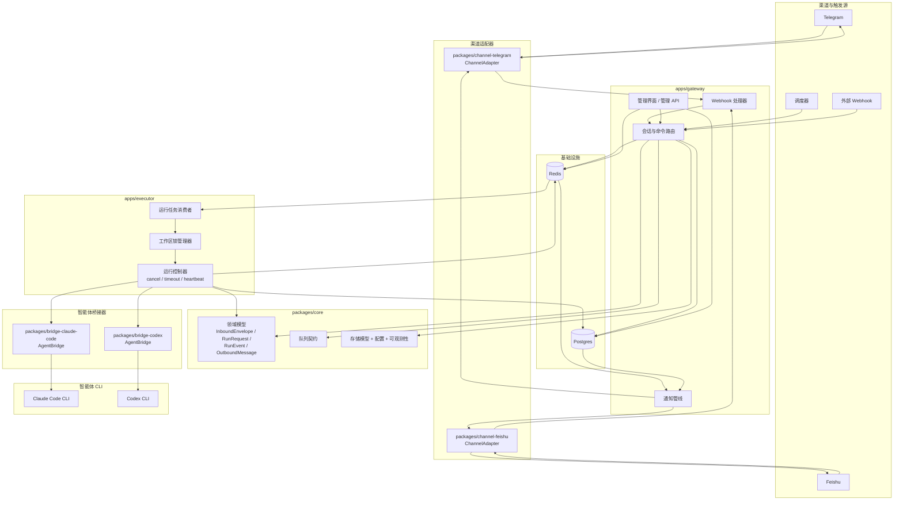
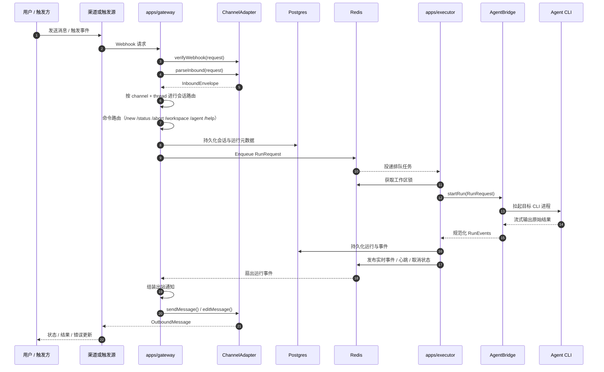

# 架构图

本文把 `plan.md` 中的系统设计转换为 Mermaid 图，便于后续用中文讨论架构与实现边界。

## 1. 运行时拓扑

## 2. 请求与执行流程

## 说明

- 图中反映的是 `plan.md` 的 v1 范围：两个渠道、两个智能体桥接器、每个工作区仅一个活动运行，以及基于 Redis 的排队与加锁。
- `apps/gateway` 负责入站归一化、会话路由、持久化、通知、调度器、外部 webhook 入口和管理能力。
- `apps/executor` 负责作业消费、工作区串行化、CLI 执行、生命周期控制和事件发布。
