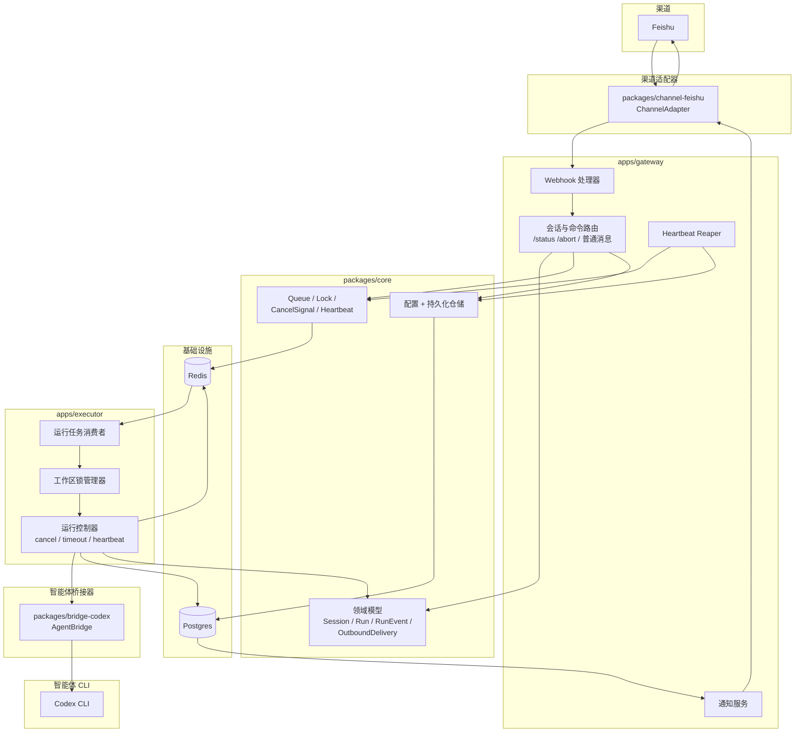
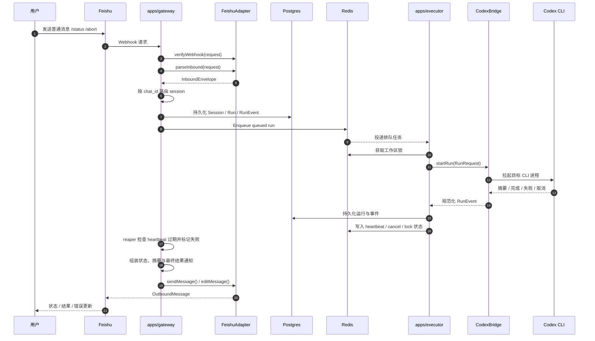

# 架构图

本文记录当前已落地的 `001-feishu-codex-mvp` 实现，而不是远期全量蓝图。当前范围只覆盖 `Feishu + Codex + 单 agent 固定 workspace`。

## 1. 运行时拓扑（当前实现）

## 2. 请求与执行流程（当前实现）

## 说明

- 当前实现只包含 `packages/channel-feishu` 和 `packages/bridge-codex`，没有引入 Telegram、Claude Code、scheduler 或 admin UI。
- `apps/gateway` 负责验签、allowlist、session 路由、命令处理、出站通知和 heartbeat reaper。
- `apps/executor` 负责消费队列、获取工作区锁、驱动 Codex bridge、处理取消和维护 heartbeat。
