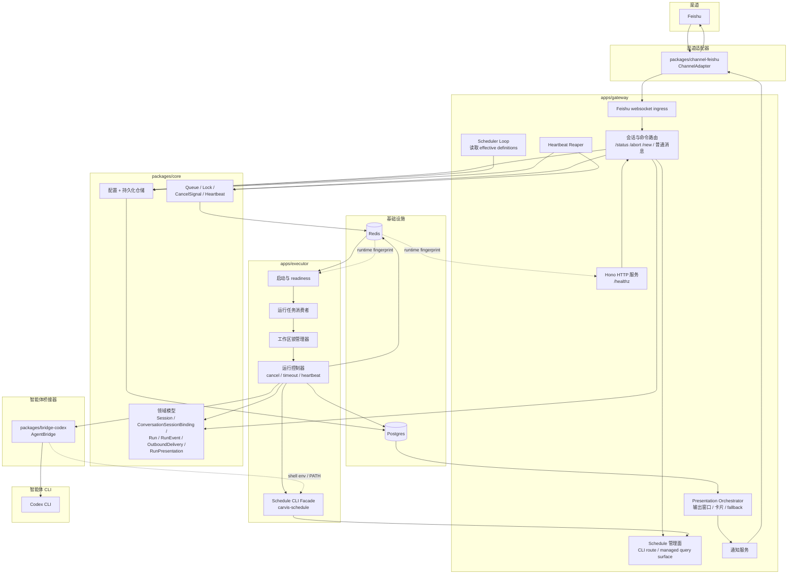
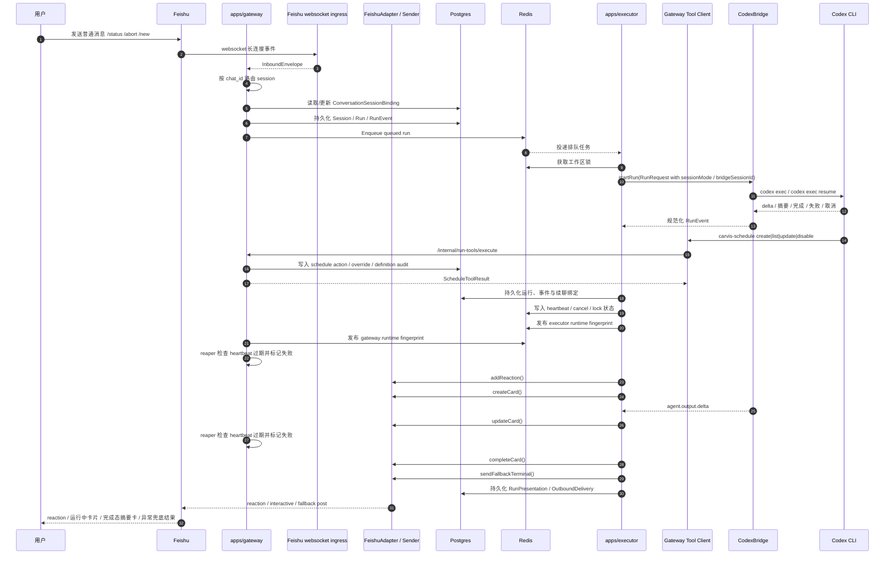

# 架构图

本文记录当前已落地的 `001-feishu-codex-mvp`、`002-local-runtime-wiring`、`003-feishu-cardkit-results`、`004-codex-session-memory` 和 `007-agent-managed-scheduling` 实现，而不是远期全量蓝图。当前范围覆盖 `Feishu websocket + Codex CLI + 单 agent 固定 workspace + 本地单机双进程 runtime + 运行中卡片与单消息终态呈现 + 同 chat Codex 原生 session 续聊 + CLI-first 的 schedule 管理控制面`。

## 1. 运行时拓扑（当前实现）

## 2. 请求与执行流程（当前实现）

## 3. 本地运行时约束

- `gateway` 与 `executor` 现在按双进程运行，统一从 `~/.carvis/config.json` 和环境变量读取运行时配置。
- `packages/channel-feishu` 负责 websocket 握手、allowlist / mention 过滤和 `InboundEnvelope` 归一化；这些细节不泄漏到 queue / run-flow。
- `gateway` 在普通消息入队前会读取当前 `ConversationSessionBinding`，决定本轮 `RunRequest` 以 `fresh` 还是 `continuation` 模式进入执行链路；`/new` 只重置当前 `chat` 的续聊绑定，不打断活动运行。
- `007-agent-managed-scheduling` 为普通消息新增了第二条控制面分支：
  - gateway 在 prompt 中持续暴露 CLI-first 的 schedule skill 约束
  - 是否调用 `carvis-schedule` 完全由 agent 自主判断
  - prompt 明确要求使用 `carvis-schedule create|list|update|disable`
  - agent 只能通过 `carvis-schedule` 修改 schedule durable state
- `carvis-schedule` 是唯一执行入口；skill 只负责调用策略和最终回复组织。
- schedule 管理动作会写入 `ScheduleManagementAction`，对 `config` 来源 definition 的修改会落到 `TriggerDefinitionOverride`，scheduler 和内部查询面统一读取 effective definition。
- `packages/channel-feishu` 同时负责工作中 reaction、运行中 `interactive` 卡片、完成态摘要卡和异常兜底终态消息的发送。
- `packages/bridge-codex` 同时保留脚本化测试 transport 和真实 `codex exec` CLI transport。
- `packages/bridge-codex` 现在同时支持：
  - `codex exec --json` 新会话执行
  - `codex exec resume --json` 续聊执行
  - 将 JSONL 输出解析为有序 `agent.output.delta`
  - 在终态事件里回传 `bridge_session_id` / `session_outcome`
  - 在续聊 session 无效时返回 `session_invalid`
  - 启动期用 `carvis-schedule --help` 做 CLI readiness probe，并把 schedule CLI bin 目录注入 PATH
- `packages/core/src/runtime/runtime-factory.ts` 现在负责：
  - 真实 Postgres / Redis 客户端装配
  - migration 触发
  - queue / lock / heartbeat / cancel 协调对象创建
  - runtime fingerprint 发布与漂移检测
- 当检测到 `CONFIG_DRIFT` 时：
  - `gateway /healthz` 返回 `ready = false`
  - `executor` 输出结构化 `CONFIG_DRIFT` 状态并拒绝进入 `consumer_active = true`
- `RunPresentation` 是 003 新增的持久化实体，用于记录：
  - `pending_start`
  - `streaming`
  - `completed / failed / cancelled`
  - `degraded`
  - 以及 `streamingMessageId / streamingCardId / fallbackTerminalMessageId / lastOutputExcerpt`
- 过程卡片创建或更新失败时，系统立即把该次呈现标记为 `degraded`，停止继续更新卡片；只有在卡片从未成功创建时，才会发送异常兜底终态消息。
- `ConversationSessionBinding` 是 004 新增的持久化实体，用于记录：
  - 每个飞书 `chat` 当前绑定的底层 Codex session
  - 最近一次显式 `/new` 重置
  - 最近一次续聊失效与自动恢复结果
  - `/status` 所需的 `fresh / continued / recent_reset / recent_recovered / recent_recovery_failed` 状态
- `executor` 在检测到 `session_invalid` 时，会在同一 run 内自动 fresh 重试一次；成功则把绑定状态写为 `recovered`，失败则保留 `recent_recovery_failed` 供 `/status` 和运维排障使用。

## 4. 说明

- 当前实现只包含 `packages/channel-feishu` 和 `packages/bridge-codex`，没有引入 Telegram 或 Claude Code。
- `apps/gateway` 负责健康检查、Feishu websocket 入站、session 路由、命令处理、呈现编排服务和 heartbeat reaper。
- `apps/gateway` 同时负责 gateway-owned `ScheduleManagementService`、`/internal/run-tools/execute` 和 `/internal/managed-schedules`。
- `apps/executor` 负责启动期 readiness、消费队列、获取工作区锁、驱动 Codex bridge、处理取消和维护 heartbeat；若宿主 `Codex` 无法执行 `carvis-schedule`，executor 会在启动期直接进入 `CODEX_UNAVAILABLE`。
- 真实本地联调依赖本机可访问的 Postgres、Redis 和已登录的 `codex` CLI。
