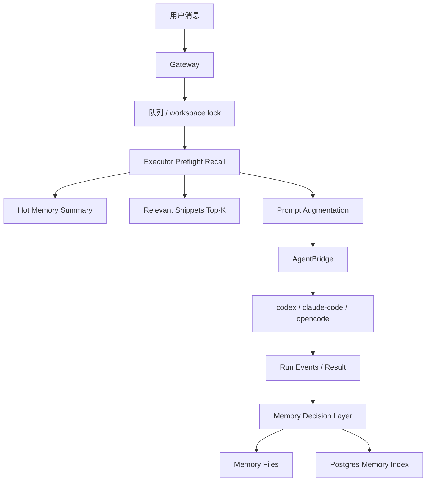
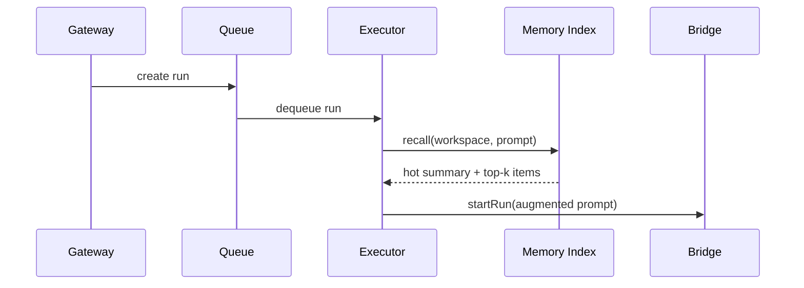
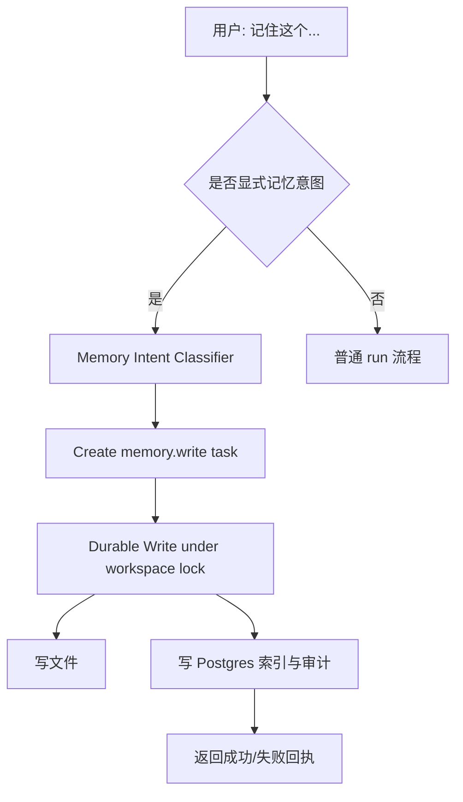

# Carvis Workspace Durable Memory 技术方案

> 状态说明：本文档为历史提案草稿，当前已由 `[2026-03-10-workspace-memory-unified-design.md](/Users/pipi/workspace/carvis/docs/plans/2026-03-10-workspace-memory-unified-design.md)` 统一收敛。若要查看当前设计、时序图、建议和可行性分析，请以统一设计文档为准。

**创建日期**: 2026-03-10  
**状态**: 历史草稿，已被统一设计文档取代  
**关联基础能力**: `004-codex-session-memory`, `005-session-workspace-binding`  
**适用范围**: `gateway` / `executor` / `packages/core` / `packages/bridge-*`

## 1. 背景与问题

`carvis` 当前已经具备两层基础能力：

1. 同一飞书 `chat` 续用底层 Agent 原生 session。
2. 同一飞书 `chat` 绑定到确定的 workspace。

这两层能力解决的是“短期会话连续性”和“执行目录隔离”，但还没有真正的“长期记忆系统”。

当前的记忆现状是：

- 短期记忆依赖底层 Agent 自带的会话上下文压缩与 continuation。
- `/new` 会重置原生 session continuation。
- workspace 虽然已经稳定，但没有跨 session 的 durable memory。
- 系统没有显式回答“存什么、何时写、何时读、如何注入”。

这会导致三个直接问题：

1. 用户明确要求“记住这个”时，系统没有可靠的 durable write 语义。
2. `/new`、session invalidation、bridge 切换后，长期事实与约定无法稳定延续。
3. 如果直接把 `MEMORY.md` 全量拼到 prompt，会造成 token 压力，并且无法控制注入时机。

## 2. 目标与非目标

### 2.1 目标

本方案的目标是为 `carvis` 引入一套：

- `workspace` 级别的 durable memory
- 对 Agent 显式可见、但由 Host 托管的 memory protocol
- 低 token 压力的确定性 recall
- 可审计、可编辑、可回滚的记忆存储
- 不破坏 `ChannelAdapter` / `AgentBridge` 边界

### 2.2 非目标

本方案明确不在 v1 实现以下能力：

- 全自动、全量的每轮对话记忆写入
- 纯向量数据库驱动的 memory retrieval
- 复杂 GraphRAG / 时序知识图谱
- 让底层 Agent 直接调用 memory backend 的 MCP/tool 面
- 跨 workspace 的全局用户画像
- 群内多 conversation 级别的 memory scope

## 3. 设计原则

本方案遵循以下原则：

1. **短期记忆留给 Agent，自身不重复做会话压缩器**  
   `codex` / `claude-code` / `opencode` 自带 session compaction，`carvis` 只补 durable memory。

2. **长期记忆跟 workspace 走，不跟 chat 走**  
   同一 workspace 可被不同 session 共享 durable memory；不同 workspace 之间隔离。

3. **文件是事实源，数据库是索引层**  
   Memory 对人类透明、可审计、可手工修正；检索和治理由结构化索引承担。

4. **读取要确定性触发，不能依赖 Agent “自己想起来搜”**  
   recall 由 `executor` 在 run 前完成，而不是让模型自行翻读大量 Markdown。

5. **显式记忆必须可靠回执**  
   当用户说“记住这个”时，系统必须有 durable write 和用户可见的确认结果。

6. **保持运行链路职责纯粹**  
   `gateway` 保持轻量 ingress；memory hydration / flush 在 `executor` 侧完成。

7. **坚持单写者模型 (Single Writer)**  
   同一 workspace 的 durable memory 写入必须经过统一串行路径，避免文件与索引层脑裂。

## 4. 当前系统映射

### 4.1 已有能力

- `ConversationSessionBinding`: 维护底层 bridge session continuation
- `SessionWorkspaceBinding`: 维护 session 到 workspace 的绑定
- `RunRequest`: 当前只包含 `prompt`、`workspace`、session continuation 信息
- `AgentBridge`: 当前是纯运行桥接，不暴露工具平面

这说明 v1 不能假设底层 Agent 能直接调用 `write_memory` / `search_memory` 工具。

### 4.2 关键约束

- `Postgres` 是 durable state，`Redis` 只做协调
- 每个 workspace 同时最多一个 active run
- `gateway` 需要快速响应 Feishu webhook / websocket
- memory 变更不能破坏当前 lifecycle、日志、heartbeat 语义

## 5. 总体方案

### 5.1 方案一句话

引入一套 **Host-managed, Agent-visible, Workspace-scoped Durable Memory**：

- Host 负责 durable write、recall、索引和审计
- Agent 能显式感知 memory protocol 的存在
- Memory 作用域绑定到 workspace
- run 前只注入小块高信噪比 memory，而不是全量文件

### 5.2 分层模型



### 5.3 记忆层次

#### L0: Durable Memory Artifacts

存储在 workspace 文件系统中，作为事实源。

建议路径：

```text
<workspace>/.carvis/memory/
  INDEX.md
  facts/
  decisions/
  preferences/
  journal/
```

#### L1: Memory Index And Audit

存储在 Postgres 中，用于：

- recall 检索
- 去重与作废
- provenance 审计
- `/status` 与未来管理界面

#### L2: Working Context

真正注入给 Agent 的记忆上下文，只包含：

- memory protocol preamble
- hot summary
- relevant snippets top-k

## 6. 存储设计

### 6.1 文件布局

推荐文件布局如下：

```text
.carvis/memory/
  INDEX.md
  facts/
    toolchain.md
    deployment.md
  decisions/
    2026-03-10-use-bun.md
  preferences/
    owner-preferences.md
  journal/
    2026-03-10.md
```

各目录职责：

- `INDEX.md`
  - 极短的 curated summary
  - 只放当前仍活跃的高价值事实与指针
- `facts/`
  - 稳定事实、环境约定、系统已知约束
- `decisions/`
  - 架构决策、技术路线、历史结论
- `preferences/`
  - 用户或团队明确表达的工作偏好
- `journal/`
  - 会话边界摘要、运行后沉淀，不直接自动注入

### 6.2 Postgres 结构

建议新增以下 durable 表：

#### `workspace_memory_items`

- `id`
- `workspace`
- `memory_type` (`fact` | `decision` | `preference` | `journal`)
- `title`
- `summary`
- `tags` (`jsonb`)
- `source_path`
- `source_span` (`jsonb`, optional)
- `status` (`active` | `superseded` | `forgotten`)
- `supersedes_item_id` (`nullable`)
- `created_by_run_id` (`nullable`)
- `created_by_user_id` (`nullable`)
- `created_at`
- `updated_at`

#### `workspace_memory_recalls`

- `id`
- `run_id`
- `workspace`
- `query_text`
- `recalled_item_ids` (`jsonb`)
- `injected_item_ids` (`jsonb`)
- `created_at`

#### `workspace_memory_writes`

- `id`
- `workspace`
- `write_kind` (`explicit` | `boundary_flush` | `condenser`)
- `source_run_id` (`nullable`)
- `source_user_id` (`nullable`)
- `request_text`
- `result_item_ids` (`jsonb`)
- `status`
- `failure_message` (`nullable`)
- `created_at`

#### `workspace_memory_sync_state`

- `workspace`
- `root_hash`
- `last_scanned_at`
- `last_synced_at`
- `sync_status` (`in_sync` | `stale` | `drift_detected`)
- `last_error` (`nullable`)

## 7. Memory 类型边界

v1 只允许写入四类内容：

1. **Fact**
   - 例如：项目统一使用 `bun`
   - 例如：CI 环境必须设置 `FOO_TOKEN`

2. **Decision**
   - 例如：该 workspace 决定使用 Hono，不再新增 Express

3. **Preference**
   - 例如：该群聊偏好“先给结论，再补细节”

4. **Journal**
   - 例如：某次 `/new` 前生成的 session 摘要

明确不写入：

- 寒暄文本
- agent 输出的冗长解释
- 普通工具流水
- 未确认的猜测

## 8. 读取设计

### 8.1 Recall 触发时机

recall 不发生在 `gateway`，而发生在 `executor` run preflight。

流程如下：



原因：

- `gateway` 需要快速返回，不适合背 recall latency
- `executor` 已经持有最终 `workspace` 和 run lifecycle
- 更符合现有 `AgentBridge` 边界
- recall 前还能顺带执行该 workspace 的轻量 drift 检查

### 8.2 Recall 算法

v1 使用 hybrid-lite，而不是向量库。

优先级：

1. workspace + `status = active` 过滤
2. 标签与 type 过滤
3. 关键词 / 精确短语匹配
4. Postgres FTS 排序
5. recency boost
6. MMR-lite 去重

最终只返回：

- `hot summary` 1 份
- `relevant snippets` 1 到 3 条

在执行 recall 前，若 `workspace_memory_sync_state.sync_status != in_sync`，先执行一次轻量 sync：

- 对 `.carvis/memory/` 目录做文件级 hash / mtime 比对
- 显式捕捉文件缺失（File Not Found）事件
- 仅重建受影响文件对应的索引条目
- 不扫描无关 workspace

### 8.3 注入格式

建议在原始用户 prompt 前增加结构化 augmentation：

```text
[Persistent Memory Protocol]
- Durable memory exists for this workspace.
- Explicit remember/forget requests must be treated as persistent operations.
- Do not assume ordinary chat should be persisted.

[Workspace Memory Summary]
- ...

[Relevant Recalled Memory]
1. ...
2. ...
```

这个格式满足两个目的：

- Agent 明确知道 durable memory 的存在
- 注入内容规模可控，不会把整份 Markdown 塞进上下文

## 9. 写入设计

### 9.1 显式写入

以下输入必须触发 durable write：

- `/remember <text>`
- `/forget <text>`
- 用户自然语言明确表达“记住这个 / 忘掉这个 / 更新这个约定”

建议自然语言显式意图由 Host 先做分类，但不直接在 `gateway` 执行最终写入，而是路由到统一的 memory write 路径。

原因：

- 用户显式要求记忆时，不能把结果托付给模型自由发挥
- 需要稳定的成功/失败回执

#### v1 Classifier 策略

v1 不采用“所有消息都调用小模型分类”的方式，也不只靠纯正则。

采用两段式识别：

1. **确定性命令路径**
   - `/remember`
   - `/forget`
   - `/memory sync`
   这些命令直接进入 memory write / sync 流程。

2. **候选语句再分类**
   - 先用廉价 lexical prefilter 标记候选消息，例如包含“记住这个”“以后都”“忘掉这个”“更新这个约定”等显式短语
   - 只有命中候选时，才进入一次轻量 intent classification
   - classification 结果必须区分：
     - `remember`
     - `forget`
     - `update`
     - `not_memory`

这能避免：

- 纯正则漏判大量自然语言表达
- 对每条普通消息都增加 LLM 分类延迟

#### 显式写入的串行化路径

所有 durable write 都必须走同一条 workspace 串行路径：

1. `gateway` 识别显式 memory intent
2. 创建一个 `memory.write` 类型的内部任务
3. 该任务进入与普通 run 相同的 workspace 队列/锁
4. `executor` 在持有 workspace lock 时完成：
   - 文件写入
   - 索引更新
   - audit 记录
   - 用户回执

这样能保证：

- 同一 workspace 不会出现并发双写
- 文件与 Postgres 的更新顺序可控
- memory 层严格继承现有 queue / lock 语义

### 9.2 边界写入

以下边界建议触发 flush：

- `/new` 前
- session invalidation 后 fresh recovery 前后
- 未来可扩展到 compaction boundary

边界 flush 只允许生成 `journal` 或候选 `fact/decision`，不能无约束写入。

### 9.3 自动提炼

`run.completed` 后允许一个低频 `Condenser Worker` 提炼候选 memory，但不作为 v1 阻塞路径。

该 worker 只做：

- stable fact extraction
- decision extraction
- preference extraction
- supersede / forget / dedupe

不做：

- 每轮强制写入
- 直接 append 整段对话

#### Condenser 触发阈值

为控制成本，Condenser 不按每次 run 立即触发。建议使用以下阈值之一：

- 同一 workspace 自上次 condenser 后累计新增 `journal` 行数 >= 50
- 或累计新增 `run.completed` >= 5
- 或距离上次 condenser 已超过 24 小时

只有满足阈值后，才调度一次低优先级提炼任务。

## 10. 自然语言“记住这个”的处理

显式记忆意图的完整路径如下：



这里的关键点是：

- “记住”不等于“在当前 session 里先别忘”
- “记住”必须转换成 durable operation
- 系统必须给出用户可见回执

## 10.1 文件与索引的一致性策略

本方案明确规定：

- **文件系统是 truth**
- **Postgres 是 derived index**

因此一致性规则如下：

1. Host 主动写入时：
   - 先在 workspace lock 下写文件
   - 计算新 hash
   - 再 upsert Postgres index 与 sync state

2. 人工修改文件时：
   - 下次 recall 前做轻量 hash / mtime 检查
   - 若发现 drift，则仅重建变更文件的索引
   - 若发现索引中存在但文件系统中已不存在的 `source_path`，则将对应 memory item 标记为 `forgotten` 或 `superseded by deletion`
   - 同时记录 `workspace_memory_sync_state`

3. 提供显式运维入口：
   - `/memory sync`
   - 用于手动触发该 workspace 的索引重建与对齐

这样可避免：

- 文件删了但索引仍 active
- 手工修正文档后 recall 继续命中旧摘要
- 索引状态长期漂移却无人感知

#### 文件删除的处理规则

当 sync 发现某个已索引的 memory 文件在文件系统中不存在时：

1. 记录一次 `File Not Found` drift 事件
2. 将对应 `workspace_memory_items.status` 更新为：
   - 优先 `forgotten`
   - 如未来需要区分原因，可扩展为 `forgotten_by_deletion`
3. 将该 item 从后续 recall 候选集中移除
4. 在 `workspace_memory_writes` 或独立 audit 中记录这次删除感知

v1 不建议直接物理删除 Postgres 记录，而是保留失效记录，原因是：

- 便于审计“为什么系统曾经记得、现在又不记得”
- 便于未来支持恢复/回滚
- 避免 recall 结果与审计历史断裂

## 11. Agent 可见但非黑盒

本方案不把 durable memory 作为 Host 黑盒偷偷运行。

每次 run 前，Host 都向 Agent 显式说明：

- 当前 workspace 存在 durable memory
- durable memory 不等于当前会话记忆
- 用户显式要求 remember/forget 时，这是持久化操作
- 普通聊天不默认长期保存

这带来两个好处：

1. Agent 知道何时应该依赖 durable memory，而不是混淆为当前对话事实。
2. 未来如果接入 `claude-code` / `opencode` / MCP，可以平滑升级为真正的 tool-based memory。

## 12. 集成点

### 12.1 Gateway

保留轻量职责：

- 命令识别
- session/workspace 路由
- 显式 memory intent 快速分流
- 不做重 recall、不做大规模 memory IO
- 不直接做最终 durable write

### 12.2 Executor

承担主要 memory orchestration：

- run preflight recall
- prompt augmentation
- boundary flush
- optional condenser scheduling
- 所有 workspace-scoped memory write / sync

### 12.3 Bridge

v1 不改造为 memory tool runtime。

只要求 bridge 接收 augmentation 后的最终 prompt，继续保持：

- `AgentBridge` 边界稳定
- 底层 agent session continuation 机制不变

## 13. 兼容性与作用域

### 13.1 与原生 session 的关系

- 原生 session continuation 仍是短期上下文主通道
- durable memory 补的是跨 `/new` 与跨 session 的长期知识
- 两者互补，不重复建设

### 13.2 与 workspace binding 的关系

- 同一 workspace 下的不同 session 共享 durable memory
- 不同 workspace 之间严格隔离
- 这与 `005-session-workspace-binding` 的模型天然一致

## 14. 分阶段实施建议

### Phase 1: MVP

- 新增 `.carvis/memory/INDEX.md` 与目录骨架
- 新增 Postgres memory index / audit 表
- 新增 `/remember` `/forget` `/memory`
- 支持自然语言显式记忆意图识别
- executor preflight recall + prompt augmentation
- `/new` 前 boundary flush
- `/status` 暴露 memory 状态摘要

### Phase 2: Condenser

- 新增低频后台提炼 worker
- 从 `RunEvent` 提炼 fact / decision / preference
- 支持去重、覆盖、作废

### Phase 3: Tool / MCP

- 将 memory 抽象为标准工具协议
- 允许不同 bridge 接入统一 memory backend
- 再评估 hybrid vector / graph

## 15. 验收标准

本方案建议以下验收点：

1. 用户明确说“记住这个”后，系统能可靠持久化并返回成功回执。
2. 用户执行 `/new` 后，新 session 仍能命中 workspace 级 durable memory。
3. run 前注入的 memory 规模固定受控，不会全量读入整个 memory 目录。
4. `/status` 能展示当前 workspace 是否存在 durable memory、最近 recall 与最近写入状态。
5. 当 memory 被新事实覆盖时，旧 memory 不会继续作为 active recall 结果被注入。

## 16. 风险与控制

### 16.1 记忆污染

风险：

- 错误事实被写入 durable memory
- 旧结论与新结论冲突

控制：

- 只允许有限类型写入
- 引入 `superseded` / `forgotten` 状态
- 先做显式写入优先，不做每轮自动写

### 16.2 Token 膨胀

风险：

- `INDEX.md` 膨胀
- recall 结果过多

控制：

- 自动注入只允许小块 summary + top-k snippets
- `journal/` 不自动注入

### 16.3 状态漂移与脑裂

风险：

- 文件系统与 Postgres 索引不一致
- 人工修改文件后 recall 命中旧内容
- 文件被手工删除后索引仍残留 active 记录

控制：

- 文件为 truth，索引为 derived
- `workspace_memory_sync_state` 记录对齐状态
- recall 前 lazy hash / mtime 检查
- 对 `File Not Found` 做显式失效处理
- 提供 `/memory sync` 运维入口

### 16.4 并发写入安全

风险：

- 显式 `/remember` 与普通 run 同时写入 memory
- 未来若放开同一 workspace 多 active run，memory 双写会失控

控制：

- 所有 durable write 必须走统一的 workspace queue / lock
- 当前方案依赖“同一 workspace 只有一个 active writer”这一前提
- 若未来放开并发，必须重新设计 memory row-level lock / file lock 机制

### 16.5 边界混淆

风险：

- 用户把 durable memory 与 session memory 混为一谈

控制：

- prompt augmentation 固定说明 memory protocol
- `/status` 明确区分 session continuation 与 durable memory 状态

## 17. 结论

结合当前 `carvis` 的架构约束，最合适的记忆方案不是：

- 纯 Markdown 全量注入
- 也不是直接复制 OpenClaw / `claude-mem` 的 tool/hook 体系

最合适的是：

- **workspace 级 durable memory**
- **文件为真相、Postgres 为索引**
- **executor preflight recall**
- **小块确定性注入**
- **显式记忆可靠持久化**
- **Agent 可见但 Host 托管**

这是当前 `carvis` 能以最低架构风险落地、同时又能为未来 MCP / 多 bridge 记忆协议演进保留空间的方案。
