# Carvis Workspace Memory 统一设计说明

**创建日期**: 2026-03-10  
**状态**: 当前主文档  
**适用范围**: `gateway` / `executor` / `packages/core` / `packages/bridge-*`  
**关联基础能力**: `004-codex-session-memory`, `005-session-workspace-binding`

## 1. 文档角色与收敛策略

本文档是 `carvis` 记忆系统的唯一主设计文档，负责回答以下问题：

- 当前到底要建设什么 memory 能力
- 这些能力如何映射到现有 `gateway` / `executor` / `AgentBridge` 架构
- 社区主流方案里哪些值得借鉴，哪些暂不采用
- MVP、后续演进和明确不做的事项分别是什么

相关文档分工如下：

- `[2026-03-10-agent-memory-community-practices.md](/Users/pipi/workspace/carvis/docs/plans/2026-03-10-agent-memory-community-practices.md)`
  - 社区调研和外部参考，不承担当前实现决策
- `[2026-03-10-agent-memory-evolution-blueprint.md](/Users/pipi/workspace/carvis/docs/plans/2026-03-10-agent-memory-evolution-blueprint.md)`
  - 远期蓝图和演进方向，不作为 MVP 交付承诺
- `[2026-03-10-workspace-durable-memory-technical-proposal.md](/Users/pipi/workspace/carvis/docs/plans/2026-03-10-workspace-durable-memory-technical-proposal.md)`
  - 历史提案草稿，已由本文档收敛和修订
- `[2026-03-10-memory-system-design-guide.md](/Users/pipi/workspace/carvis/docs/plans/2026-03-10-memory-system-design-guide.md)`
  - 历史设计导读，保留背景但不再扩写

## 2. 背景与核心判断

`carvis` 当前已经具备两层基础能力：

1. 同一飞书 `chat` 可以续用底层 agent 原生 session。
2. 同一飞书 `chat` 可以绑定到稳定的 workspace。

但当前仍缺少跨 session 的 durable memory，导致以下问题仍然存在：

- `/new` 之后，长期事实与约定无法稳定延续
- 用户明确说“记住这个”时，没有可靠的 durable write 语义
- 若直接把整份 `MEMORY.md` 拼入 prompt，会引入明显 token 压力和噪音

本设计的核心判断是：

- 短期上下文继续依赖底层 agent session continuation
- 长期记忆应绑定到 `workspace`，而不是绑定到单次 `chat` continuation
- recall 由 host 在 `executor` preflight 阶段确定性触发
- durable write 由 host 托管，不能指望 agent 自己“想到再写”

## 3. 目标、非目标与设计原则

### 3.1 目标

- 引入 `workspace` 级 durable memory
- 对 agent 显式可见，但由 host 托管 memory protocol
- run 前只注入小块高信噪比 memory，而不是全量文件
- 保持文件可读、可审计、可手工修正
- 不破坏 `ChannelAdapter` / `AgentBridge` 边界

### 3.2 非目标

v1 不做以下能力：

- 全自动、全量的每轮对话记忆写入
- 纯向量数据库驱动的 retrieval
- 复杂 GraphRAG / 时序知识图谱
- 让底层 agent 直接调用 memory backend 的 MCP/tool 面
- 跨 workspace 的全局用户画像
- 将 `/new` 边界 flush 作为 MVP 必须能力

### 3.3 设计原则

1. **短期记忆留给 Agent**  
   `carvis` 不重复实现 session compaction。

2. **长期记忆跟 workspace 走**  
   同一 workspace 下不同 session 共享 durable memory，不同 workspace 严格隔离。

3. **文件是事实源，数据库是索引层**  
   文件负责可读和可人工修正，数据库负责 recall、状态和审计。

4. **读取必须确定性触发**  
   recall 由 `executor` 在 run preflight 执行，而不是依赖模型自己“想起来搜”。

5. **显式记忆必须有可靠回执**  
   “记住这个 / 忘掉这个”必须形成 durable operation 和用户可见结果。

6. **坚持单写者模型**  
   同一 workspace 的 durable write 必须串行化，避免文件与索引层脑裂。

## 4. 社区方案映射与取舍

### 4.1 社区中被验证的模式

社区主流方案在以下方向上高度一致：

- **项目级 / 工作区级 memory scope**
  - Claude Code `CLAUDE.md`
  - Cursor Project Rules / Memories
- **host-managed memory**
  - Anthropic memory tool 明确由 client 侧管理存储
- **事件流与异步冷凝**
  - OpenHands resume + context condenser
- **事实生命周期**
  - Mem0 / Zep 强调 fact extraction、invalidate、supersede

### 4.2 对 `carvis` 的明确采纳

本方案明确采纳：

- workspace-scoped durable memory
- 文件型 memory artifact
- executor preflight recall
- summary + top-k snippet 的小块注入
- `superseded` / `forgotten` 一类生命周期
- 显式 `/remember` / `/forget` 的 host 托管 durable write

### 4.3 对 `carvis` 的明确不采纳

当前阶段明确不采纳：

- 把所有消息都自动送入 LLM 分类和持久化
- 纯 vector-first memory retrieval
- 立即引入 MCP / tool-based memory runtime
- 在 `gateway` 做重 recall 和大规模 memory IO
- 将 `/new` 边界 flush 作为 v1 阻塞路径

### 4.4 取舍理由

这些取舍来自两个事实：

- 社区成熟方案证明“文件 + 轻索引 + preflight recall”在工程场景下投入产出比最高
- `carvis` 当前架构里真正稳定的 durable source 是 Postgres + workspace 文件系统，而不是底层 bridge session 本身

## 5. 与当前系统的映射

### 5.1 已有能力

- `ConversationSessionBinding`
  - 维护底层 bridge session continuation
- `SessionWorkspaceBinding`
  - 维护 `chat` 到 workspace 的绑定
- `Run` / `RunEvent`
  - 承担运行生命周期和事件流
- `workspace queue` + `workspace lock`
  - 保证当前模型下同一 workspace 同时最多一个 active run

### 5.2 关键约束

- `Postgres` 是 durable state，`Redis` 只做 coordination
- `gateway` 需要快速响应 Feishu websocket / webhook
- `AgentBridge` 当前是纯运行桥接，不暴露 memory tool 面
- 当前 `/new` 只重置 continuation，不导出底层 session 摘要

### 5.3 当前主结论

这意味着：

- recall 必须放在 `executor`
- v1 不能假设底层 agent 能直接执行 `write_memory` / `search_memory`
- `/new` 边界不适合被定义为“必须同步 flush durable memory”的实现点

## 6. 统一架构

### 6.1 总体架构图

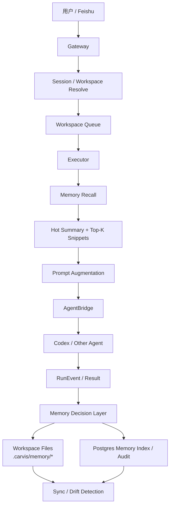

### 6.2 分层模型

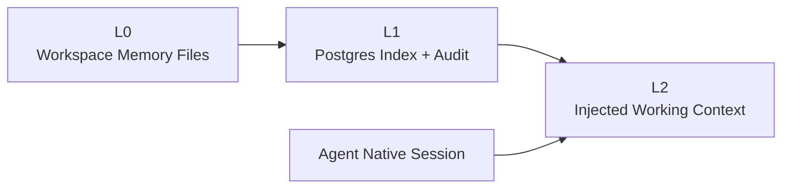

分层职责：

- `L0`
  - `.carvis/memory/INDEX.md`
  - `facts/`, `decisions/`, `preferences/`, `journal/`
- `L1`
  - recall 索引
  - 生命周期状态
  - provenance 审计
- `L2`
  - 只包含 protocol preamble、hot summary、top-k snippets
- `Agent Native Session`
  - 继续负责短期上下文和当前 continuation

## 7. 关键时序图

### 7.1 普通 run 与 preflight recall

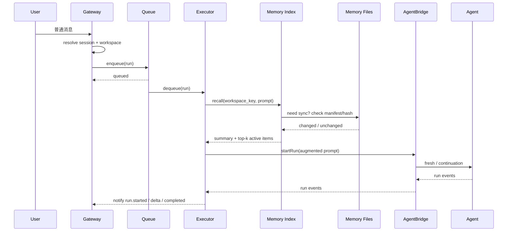

### 7.2 显式 `/remember`

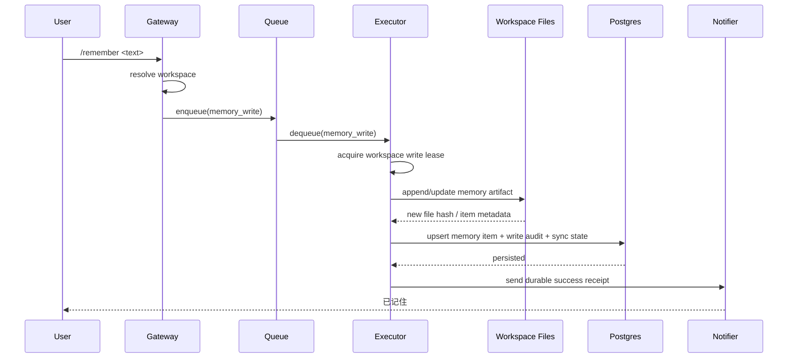

### 7.3 显式 `/forget`

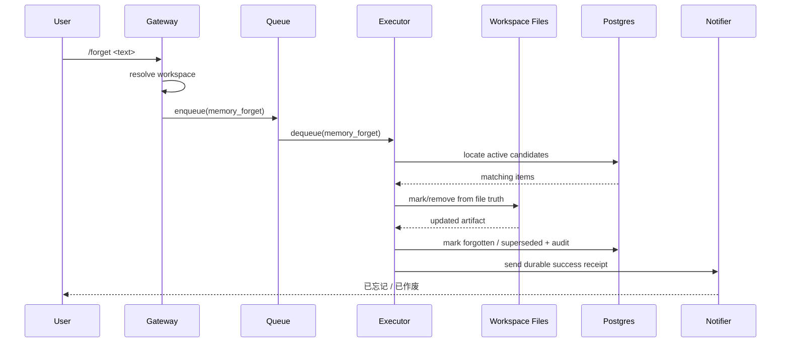

### 7.4 `/memory sync`

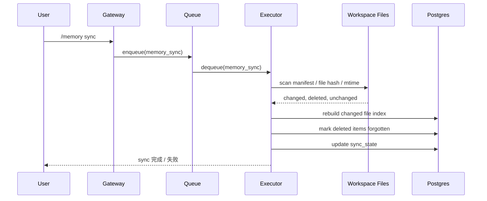

### 7.5 `/new` 与 durable memory 的边界

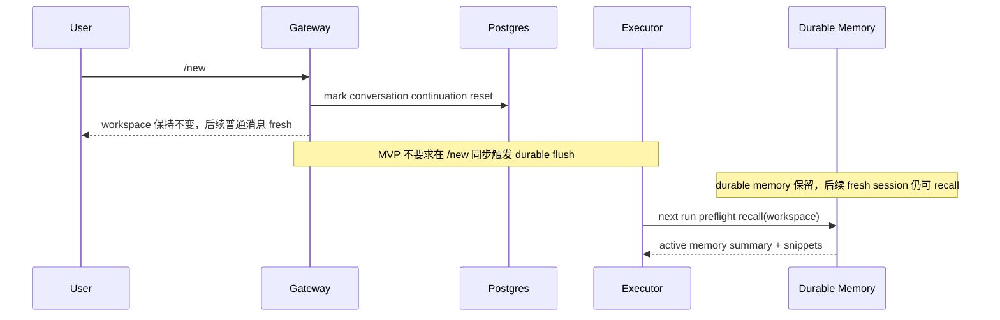

### 7.6 Phase 2 异步 condenser

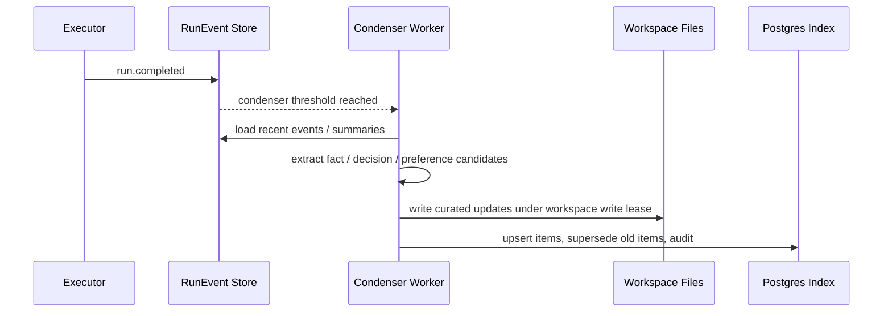

## 8. 存储设计

### 8.1 文件布局

```text
<workspace>/.carvis/memory/
  INDEX.md
  facts/
    toolchain.md
    deployment.md
  decisions/
    2026-03-10-use-bun.md
  preferences/
    owner-preferences.md
  journal/
    2026-03-10.md
  manifest.json
```

建议约束：

- `INDEX.md`
  - 只保留当前活跃的高价值事实摘要和指针
- `facts/`
  - 稳定事实、环境约定、系统约束
- `decisions/`
  - 架构决策、技术路线、已确认选择
- `preferences/`
  - 用户或团队偏好
- `journal/`
  - 边界摘要和原始沉淀，不默认自动注入
- `manifest.json`
  - v1 推荐引入，用于记录每个文件的 hash / parser version / scan 时间

### 8.2 逻辑主键选择

memory 的逻辑作用域应绑定到 `workspace_key`，而不是物理路径。

原因：

- `workspace_path` 可能在 catalog 中迁移
- durable memory 的语义是“同一逻辑 workspace 的持续知识”
- path 更适合作为当前文件根路径，而不是 durable identity

### 8.3 数据模型

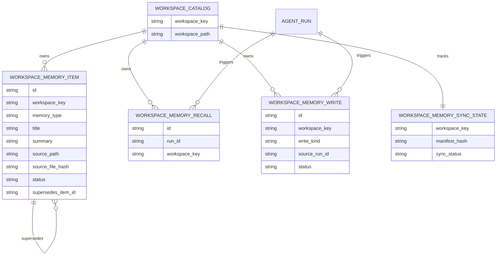

### 8.4 生命周期状态

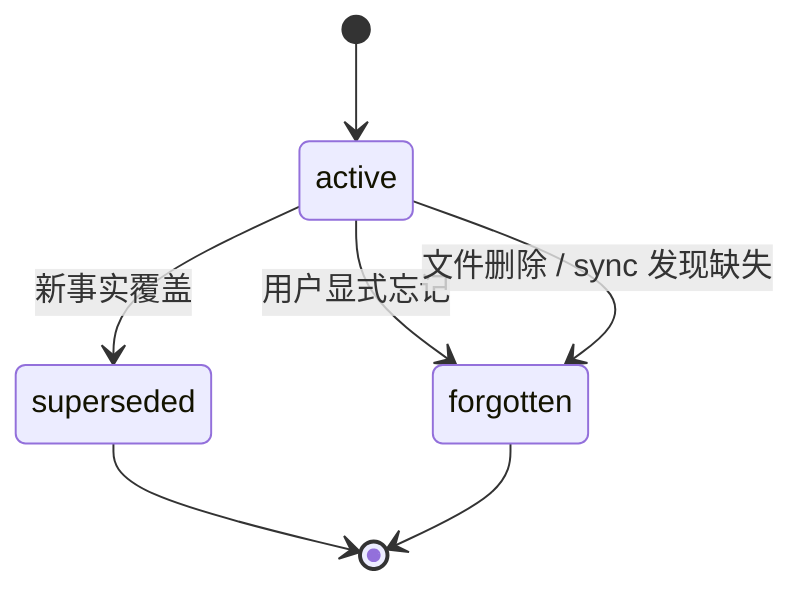

## 9. MVP 边界

### 9.1 MVP 必做

- workspace-scoped memory 文件骨架
- Postgres memory index / audit 表
- `executor` preflight recall
- prompt augmentation
- `/remember` `/forget` `/memory sync`
- `/status` 增加 durable memory 摘要字段
- sync drift 的最小可见状态

### 9.2 MVP 可选但不阻塞

- 候选自然语言显式记忆分类
- recall 的 BM25 / FTS 排序优化
- `journal/` 自动写入摘要

### 9.3 不应进入 MVP

- `/new` 前 boundary flush
- 每轮自动写记忆
- tool-based memory runtime
- vector / graph memory 基础设施

## 10. 可行性分析

### 10.1 为什么这套方案可行

这套方案可行，原因有三：

1. **与当前架构边界一致**
   - `gateway` 继续轻量 ingress
   - `executor` 已天然拥有 workspace、run lifecycle 和 queue/lock 语义
   - `AgentBridge` 仍可保持纯运行桥接

2. **社区已有大量同类成功路径**
   - Claude Code / Cursor 已证明项目级文件 memory 可用
   - OpenHands 已证明 session resume 与 condenser 应分层处理
   - Mem0 / Zep 已证明“事实提炼 + 生命周期”是可持续方向

3. **对当前实现侵入度可控**
   - 可以先复用现有 workspace resolve、run lifecycle、notifier
   - durable memory 是增量能力，不需要推翻 `004` / `005`

### 10.2 当前方案的工程缺口

虽然总体可行，但以下缺口必须在实现前被显式承认：

1. **workspace lock 目前不是可续租 lease**
   - 当前 Redis lock 只有 acquire 时设置 TTL
   - 对长运行、sync、condenser 不足以保证 single writer

2. **当前 queue 只承载 `runId`**
   - 若要引入 `memory.write` / `memory.sync`，需要统一任务 envelope 或等价建模

3. **当前 `/new` 无法导出底层 session 摘要**
   - 因此不应把 `/new boundary flush` 作为 MVP 阻塞点

4. **若只按 `workspace_path` 建模会引入 identity 漂移**
   - durable memory 应以 `workspace_key` 为主键

5. **若没有 per-file manifest，增量 sync 很难做准**
   - 建议在 v1 就引入最小 manifest/hash 机制

### 10.3 风险等级判断

- **低风险**
  - 文件骨架
  - preflight recall
  - prompt augmentation
  - audit 表

- **中风险**
  - 显式 `/remember` `/forget`
  - drift sync
  - `/status` memory 摘要展示

- **高风险**
  - `/new` 边界 flush
  - 无确认自然语言自动记忆
  - 未升级 lease / queue 模型前就引入后台 condenser

## 11. 建议

### 11.1 推荐的近期路线

1. 先实现 **显式 durable memory**
   - `/remember`
   - `/forget`
   - `/memory sync`

2. recall 先控制在 **固定规模**
   - `INDEX.md`
   - 1 到 3 条 active snippets

3. 明确区分两类状态
   - session continuation 状态
   - durable memory 状态

4. 先补基础设施缺口
   - workspace write lease 可续租
   - memory task 建模
   - manifest/hash

### 11.2 中期路线

- 引入低频 condenser worker
- 从 `RunEvent` / 终态摘要提炼 candidate facts
- 加强 recall 排序和去重

### 11.3 远期路线

- 再评估 MCP / tool-based memory
- 再评估 vector / graph memory
- 再评估多 agent 共享 memory

## 12. 验收标准

1. 用户显式 `/remember` 后，系统能在 workspace 下可靠持久化并返回成功回执。
2. 用户显式 `/forget` 后，对应 memory 不再出现在 active recall 结果中。
3. 用户执行 `/new` 后，session continuation 被重置，但 durable memory 仍能在后续 fresh run 中被 recall。
4. run 前注入的 memory 规模固定受控，不会全量读取整个 memory 目录。
5. 文件被手工修改或删除后，`/memory sync` 能修复索引状态并反映到后续 recall。

## 13. Benchmark 设计

### 13.1 为什么必须建立 benchmark

memory 系统如果没有 benchmark，很容易出现三种伪进展：

- 偶发命中被误认为系统已经“记住了”
- recall 质量提升的同时，token 和延迟成本已经失控
- 新增自动记忆能力后，误写和旧事实污染没有被及时发现

因此本方案要求：

- memory benchmark 是正式交付物，而不是上线后的补充工作
- 没有 benchmark 基线，不允许扩大自动记忆范围
- 每次 recall / classifier / sync 策略调整后，都必须跑回归 benchmark

### 13.2 Benchmark 要回答的核心问题

第一阶段 benchmark 需要同时回答两类问题：

1. **效果是否可靠**
   - 该写入的 memory 是否被正确写入
   - 该召回的 memory 是否被正确召回
   - 已覆盖或已忘记的旧事实是否被正确移出 active recall

2. **成本是否可控**
   - recall 前置阶段带来了多少 token 成本
   - classifier / recall / sync 带来了多少延迟
   - memory 文件和索引维护带来了多少额外扫描与写入开销

### 13.3 第一阶段 benchmark 作用域

第一阶段不只测显式命令，而是覆盖完整链路：

- `/remember`
- `/forget`
- 普通 run 的 preflight recall
- 自然语言 memory intent classification
  - `remember`
  - `forget`
  - `update`
  - `not_memory`

明确不纳入第一阶段 benchmark 的内容：

- vector / graph retrieval
- MCP / tool-based memory
- condenser 的开放式自动提炼质量

### 13.4 Benchmark 架构

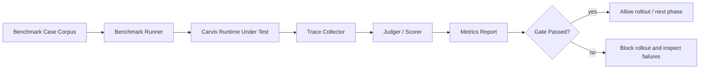

### 13.5 数据集设计

采用混合评测：

- **标准任务集**
  - 人工构造、强约束、可重复运行
  - 作为主 benchmark
- **真实回放样本**
  - 从真实 chat / run event 中脱敏抽样
  - 用于校准“人工任务过于理想化”的偏差

建议数据集按以下层次组织：

| 层级 | 来源 | 作用 | 占比建议 |
| --- | --- | --- | --- |
| `L1-golden` | 人工构造 | 回归主基线，必须稳定 | 70% |
| `L2-replay` | 真实回放脱敏样本 | 校准真实性 | 20% |
| `L3-adversarial` | 对抗样本 | 验证误写、误召回和冲突处理 | 10% |

### 13.6 Case 类型

第一版至少覆盖以下 case：

| 类别 | 样例 | 期望结果 |
| --- | --- | --- |
| 显式写入 | `/remember 本项目统一使用 bun` | 写入 `fact` 或 `decision`，返回成功回执 |
| 显式遗忘 | `/forget 不再使用 yarn` | 目标 item 进入 `forgotten` 或被新事实覆盖 |
| 自然语言 remember | `记住这个，以后默认先给结论再给细节` | 分类为 `remember`，持久化为 `preference` |
| 自然语言 not_memory | `你先想想这个问题` | 分类为 `not_memory`，不得写入 durable memory |
| 更新旧事实 | `之前说用 yarn 作废，现在统一 bun` | 旧 item `superseded`，新 item `active` |
| 普通 recall | 后续 run 提问 `怎么启动这个项目` | 命中 `bun` 相关记忆 |
| `/new` 后 recall | `/new` 后再次提问 | session fresh，但 durable memory 仍命中 |
| 文件漂移 | 人工删掉某 memory 文件后执行 `/memory sync` | 索引失效并停止命中旧事实 |
| 冲突样本 | 同时出现旧事实与新事实 | 仅注入当前 active 事实 |
| 噪音样本 | 寒暄、抱怨、无长期价值消息 | 不落库、不进入 recall |

### 13.7 单条 case 的评测流程

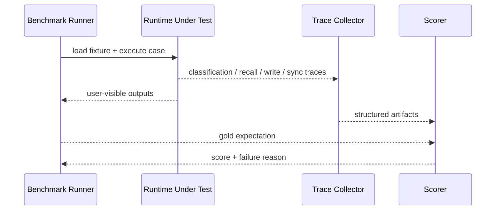

每条 case 至少要记录这些 artifact：

- 原始输入消息序列
- 期望分类标签
- 期望写入结果
- 期望被召回的 item 集合
- 实际 prompt augmentation 内容
- 实际 token / latency / scanned file count

### 13.8 指标体系

#### 效果指标

| 指标 | 含义 |
| --- | --- |
| `intent_precision` | 被判为 memory intent 的消息里，真正属于 memory 的比例 |
| `intent_recall` | 所有应该进入 memory 流程的消息里，被成功识别的比例 |
| `false_write_rate` | 普通消息被误持久化的比例 |
| `write_success_rate` | memory write 任务成功完成的比例 |
| `recall_precision_at_k` | 注入的 top-k 记忆中真正相关的比例 |
| `recall_hit_rate` | 该命中的 case 中至少命中一个正确 memory 的比例 |
| `stale_recall_rate` | 已 `superseded` / `forgotten` 的旧事实仍被注入的比例 |
| `contradiction_rate` | 同时注入互相冲突 memory 的比例 |
| `durable_recall_after_reset` | `/new` 后仍能命中 durable memory 的比例 |

#### 成本指标

| 指标 | 含义 |
| --- | --- |
| `classifier_latency_ms` | 分类阶段耗时 |
| `recall_latency_ms` | recall + ranking 阶段耗时 |
| `sync_latency_ms` | `/memory sync` 或 lazy sync 耗时 |
| `preflight_latency_ms` | 整个 memory preflight 耗时 |
| `augmentation_tokens` | memory augmentation token 数 |
| `augmentation_token_ratio` | augmentation token 占总 prompt token 的比例 |
| `files_scanned_per_sync` | 每次 sync 扫描文件数 |
| `pg_writes_per_memory_op` | 每次 memory 操作产生的数据库写入次数 |

### 13.9 首批必须盯住的红线指标

第一阶段最关键的不是“平均表现还行”，而是以下三条红线：

- `false_write_rate`
  - 普通聊天被误记住的比例
- `stale_recall_rate`
  - 已失效旧事实仍进入 prompt 的比例
- `missed_durable_recall_rate`
  - 已成功写入且本应命中的 durable memory 没有被召回的比例

建议将这三项作为 memory 是否继续扩面的 gate。

### 13.10 推荐 gate

在没有真实生产分布之前，先采用保守 gate：

| gate | 建议阈值 |
| --- | --- |
| `false_write_rate` | `L1-golden` 必须为 `0` |
| `stale_recall_rate` | `L1-golden` 必须为 `0` |
| `write_success_rate` | 显式 `/remember` `/forget` 在 `L1-golden` 必须为 `100%` |
| `recall_hit_rate` | 关键 recall case 至少 `>= 95%` |
| `durable_recall_after_reset` | `/new` 相关 case 至少 `>= 95%` |
| `augmentation_token_ratio` | 默认目标 `<= 20%` |
| `preflight_latency_ms` | 不应显著吞掉总交互预算，建议先跟踪 `P50/P95` 再收紧 |

说明：

- 准确率阈值可以在真实回放积累后再调整
- 但 `false_write_rate` 和 `stale_recall_rate` 在 golden 集上不应被放宽

### 13.11 Benchmark 驱动的发布策略

建议把 rollout 明确分成三档：

1. **实验态**
   - 只跑 benchmark，不对真实用户开放自动记忆
2. **受限灰度**
   - 仅开启显式 `/remember` `/forget`
   - 自然语言分类先 shadow 模式打分，不真正写入
3. **正式启用**
   - benchmark 连续通过
   - 真实回放样本误写率和旧事实污染率在可接受范围内

### 13.12 对当前方案的直接建议

对 `carvis` 当前 memory 方案，benchmark 不应是后补，而应与 MVP 同时设计：

1. 先定义 fixture 和 gold output，再实现 classifier / recall
2. 先记录 token / latency trace，再讨论 recall 排序优化
3. 先用 shadow 模式验证自然语言分类，再开放自动 durable write
4. 没有 benchmark 报告，不要宣称 memory “已经可用”

## 14. 参考依据

- Claude Code Memory
  - <https://code.claude.com/docs/en/memory>
- Anthropic Memory Tool
  - <https://platform.claude.com/docs/en/agents-and-tools/tool-use/memory-tool>
- Cursor Rules
  - <https://docs.cursor.com/context/rules>
- Cursor Memories
  - <https://docs.cursor.com/en/context/memories>
- OpenHands Resume
  - <https://docs.openhands.dev/openhands/usage/cli/resume>
- OpenHands Context Condenser
  - <https://docs.openhands.dev/sdk/guides/context-condenser>
- Mem0 Memory Operations
  - <https://docs.mem0.ai/core-concepts/memory-operations/add>
- Mem0 Graph Memory
  - <https://docs.mem0.ai/open-source/features/graph-memory>
- Zep Quickstart
  - <https://help.getzep.com/v2/quickstart>
- Zep Facts
  - <https://help.getzep.com/v2/facts>
